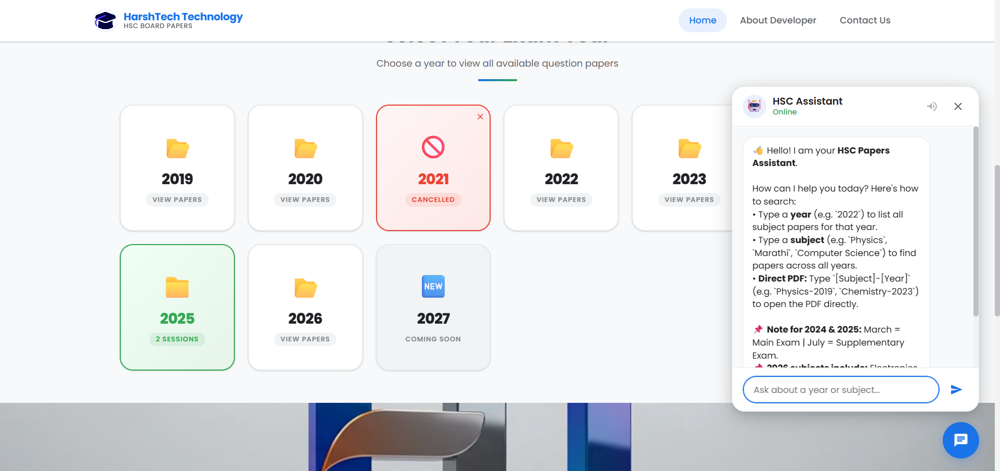

# 📚 HSC Board Previous Year Question Papers Software

<p align="center">
  
</p>

<p align="center">
  <strong>A premium, responsive, and user-friendly web portal designed exclusively for HSC Science students to access previous year question papers.</strong>
</p>
<hr>
<center>

</center><br>
<p align="center">
  
  
  
  
</p>


---

## 🌟 Key Features

*   **📅 Comprehensive Year Coverage (2019–2026):** Seamless single-page navigation to access HSC exam question papers across multiple years.
*   **🩺 2021 COVID-19 Cancelled Alert:** Displays a custom, stylized modal when the 2021 card is clicked, explaining the exam cancellation due to the pandemic.
*   **📑 Dual-Session Support (2024 & 2025):** Clickable paths for both **July (Main Exam)** and **March (Supplementary Exam)** papers, complete with explanatory descriptions for the supplementary option.
*   **🧪 Science Stream Subjects:** Focused set of papers containing **Physics, Chemistry, Mathematics, Biology** along with **English, Geography, and Hindi**.
*   **🔍 Smart Missing Paper Fallback:** When a PDF link is blank, a beautiful popup alerts the user that the paper is currently not found and will be uploaded soon.
*   **🎥 Premium Footer Branding:** Features an autoplaying loop video background in the footer showcasing the **HarshTech Technology** branding.
*   **👨‍💻 About Developer Page:** Clean profile layout featuring **Harshad Teli**, using a custom profile card, LinkedIn integration, and a mail shortcut.
*   **📱 Ultra Responsive Design:** Fully optimized layout adapting smoothly to desktops, tablets, and mobile devices (includes a sleek hamburger menu).

---

## 🛠️ Technology Stack

*   **Markup:** HTML5 (Semantic elements, optimized SEO tags)
*   **Styling:** Custom CSS3 (CSS Custom Properties, Flexbox, CSS Grid, custom keyframe transitions/stagger animations)
*   **Scripting:** Vanilla JavaScript (Dynamic DOM rendering, clean routing state, modal trigger controller)

---
<hr>

<center>

</center>
<hr>
---
## 📁 Repository Structure

```files
HSC-BOARD-PPAPERS-SOFTWARE-WEB/
├── index.html                   # Main application entry point (SPA)
├── README.md                    # Project documentation
├── info.txt                     # GitHub release metadata
└── assets/
    ├── CSS/
    │   └── style.css            # Base tokens, layouts, animations, media queries
    ├── JS/
    │   └── main.js             # Paper data mapping, modals, rendering & routing
    ├── DATA/
    │   ├── 2019/                # 2019 Question Paper PDFs
    │   ├── 2020/                # 2020 Question Paper PDFs
    │   ├── 2022/                # 2022 Question Paper PDFs
    │   └── 2023/                # 2023 Question Paper PDFs
    │   └── 2024/                # 2024 Question Paper PDFs
    │   └── 2025/                # 2025 Question Paper PDFs
    │   └── 2026/                # 2026 Question Paper PDFs
    │   └── 2027/                # 2027  Coming Soon
    ├── VIDEO/
    │   └── logo.mp4             # Footer branding background loop
    └── LOGO/
        └── logo.webp            # Brand logo
```

---

## 🚀 Getting Started & Deployment

### Run Locally
Simply open the `index.html` file in any modern web browser, or use a local development server like VS Code Live Server:
1. Clone the repository:
   ```bash
   git clone https://github.com/your-username/-HSC-BOARD-PAPERS-SOFTWARE-WEB.git
   ```
2. Navigate into the directory and open `index.html`.

### Deploying to GitHub Pages
Since this is a static client-side web application, it can be hosted for free on **GitHub Pages**:
1. Push your repository to GitHub.
2. Navigate to your repository **Settings** → **Pages**.
3. Under **Build and deployment**, set the source to **Deploy from a branch**.
4. Choose the `main` or `master` branch and folder `/ (root)`.
5. Click **Save**. Your site will be live within minutes!

---

## ⚙️ Customization Guide

### Adding new PDF files
To update or link additional question papers, modify the `PAPER_DATA` object inside [`assets/JS/main.js`](assets/JS/main.js):
```javascript
const PAPER_DATA = {
  2019: {
    Physics:     "assets/DATA/2019/Physics_2019.pdf",
    Chemistry:   "assets/DATA/2019/Chemistry_2019.pdf",
    // Replace empty strings with file paths or links
    English:     "assets/DATA/2019/English_2019.pdf", 
  },
  ...
}
```

---

## 👨‍💻 Developer & Team

*   **Developer:** Harshad Teli
*   **Company/Brand:** HarshTech Technology
*   **Target Audience:** Maharashtra State Board HSC Science Stream Students

---

## 📄 License

This project is licensed under the MIT License.
